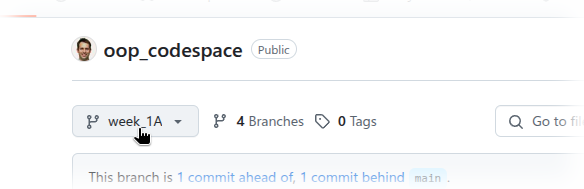
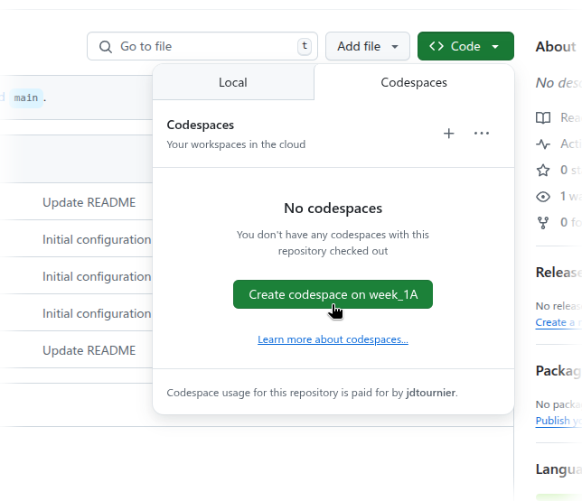
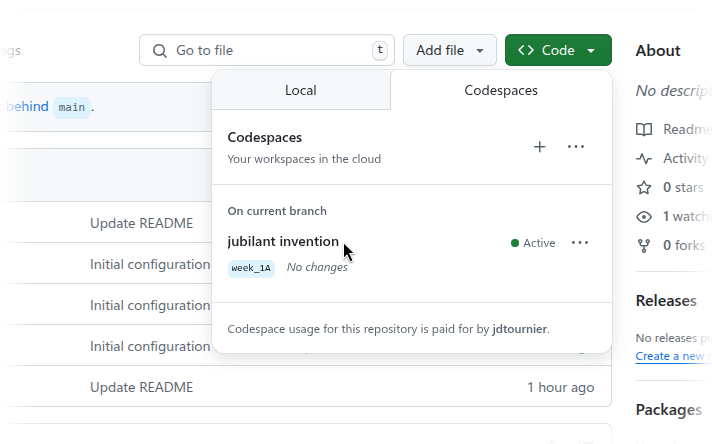
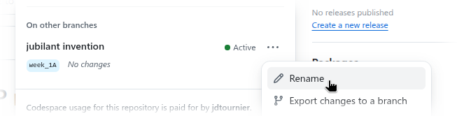
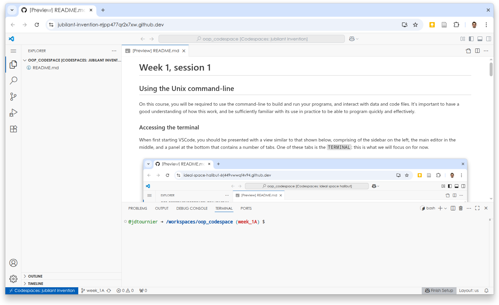
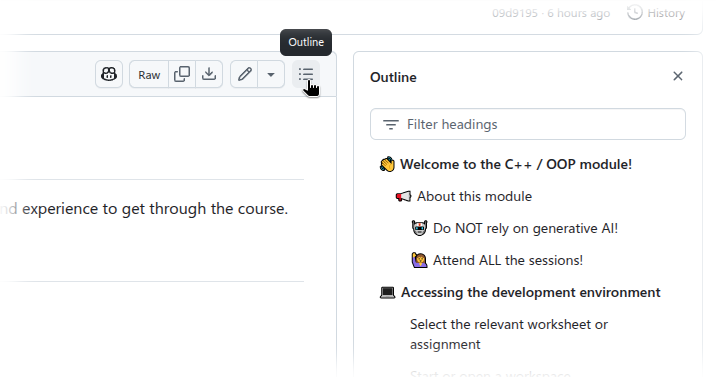

# 👋 Welcome to the C++ / OOP module!

This page provides access to the tasks and assignments that will give you the
necessary practice and experience to get through the course. 

## 📢 Making the most of this course

This course is organised into worksheets, each designed to guide you through
the material and exercises for a single session.  To make the most of this
course, please follow this general advice:

### 📖 Read any required preliminary material before the corresponding session

To maximise hands-on practice time during the sessions, most of the more
theoretical aspects will be provided as preliminary reading (shown on KEATS,
and [on this page](#course-contents)). To make the most of the
session, please make sure to go through this material before attending the
sessions. This will allow you to focus on going through the corresponding
worksheet during the session, and to gain the necessary practical experience
with these various concepts and features.

### 🙋 Attend *all* the sessions!

All sessions will be held in Student Computer Rooms, and are designed as
practical, hands-on tutorials. These will provide you with regular blocks of
time to practice &ndash; and **practice is essential** to get through this module!

In addition, there will be plenty of teaching staff and assistants on hand to
help you along. It is much better to ask one of us when you get stuck, than to
ask a chatbot!

**The best way to build up enough programming experience to do well on this
module is to attend all the sessions in person.**

### 🏋 Try *all* the exercises!

The worksheets provide lots of exercises for you to try, all designed to build
your experience with aspects of C++ that we consider important on this course.
Please try to them all, and if you struggle with any of them, ask!

Exercises are clearly labelled in the worksheet using the 'play' icon, as shown
below:

 

▶️ This is an exercise. Please try it!

 

### 🔔 Hints, warnings and additional information

Every so often, the worksheets provide short snippets of extra information,
formatted as follows:

> 💡 Hints are provided in small sections with a lightbulb. These provide
> useful information that may prove useful, for example when attempting the exercises.

> ⚠️ Warnings are shown using the standard icon, and may alert the reader to
> various issues they may encounter, and what to do about them.

> 🎓 Sometimes, more in-depth information is provided in a small section with a
> scholar's cap. These contain information that is not considered essential to
> complete the course, but should be of interest for motivated students.  

### 🤖 Do NOT rely on generative AI!

The use of generative AI tools (chatGPT, Microsoft Copilot, Google Gemini,
Claude Sonnet, ...) is **strictly forbidden** for *all* formative assessments
on this course. All assessments will be monitored, and any student caught using
such tools will immediately be referred to the Student Conduct & Appeals
Office, according to [KCL academic misconduct
procedures](https://self-service.kcl.ac.uk/article/KA-01219/en-us).

More generally, we **strongly** discourage the use of these tools to *write*
code (though you are welcome to ask them to explain concepts, error messages,
etc). In our experience, and [that of many other
professionals](https://time.com/7295195/ai-chatgpt-google-learning-school/),
generative AI can all too easily be abused to provide easy answers to tasks and
assignments, depriving students of the opportunity to learn and build up the
necessary experience. When faced with formal assignments where these tools are
not available, students who have previously relied on these tools find
themselves incapable of performing even the simplest tasks.

The exercises and tasks we have compiled on this course are designed to build
up your understanding and most importantly, your *experience* with programming.
To be an effective programmer, it is not sufficient to *understand* the material:
you need to *think* like a programmer, and that will only come with a lot of practice.

If you find yourself struggling with a specific exercise or task, don't worry:
you are meant to! Resist the urge to use AI for an easy fix, and try to work
out the problem for yourself: struggling through problems is the most effective
way to learn, even if it can sometimes feel immensely frustrating. You are
encouraged to use regular online searches (or even generative AI tools) to
understand specific error messages, or to find inspiration for how to approach
certain problems, but it is *essential* that you take these times as
opportunities to learn and improve your own skills. If you do, you will quickly
find yourself making fewer and fewer mistakes, writing better code, and
completing tasks and assignments faster.

### 🔗 Follow the links!

The worksheets provide the basic information necessary to go through the
exercises and build up your experience with programming in C++. But they cannot
go through all the many nuances of the language and explain every aspect of
every C++ feature! Where relevant, the worksheets contain links to external
resources with more in-depth material on specific topics: please click on them
to get a better handle on these topics.

### 📚 Use external reference material

This course is a very basic introduction to C++, and many features are explained
in just enough detail for you to make use of them. You are encouraged to refer
to textbooks and other online sources to further your understanding, to see
more examples of C++ code, to appreciate different perspectives on programming,
and maybe find alternative descriptions of aspects of C++ that you find
difficult. 

We recommend [learncpp.com](https://www.learncpp.com/) as a great
free online resource, but there are many other resources and textbooks
available! 

# 💻 Accessing the development environment

This module will rely on 
[GitHub Codespaces](https://github.com/features/codespaces) to provide a
consistent development environment for all students. To access this
environment, you will first need to [create a personal GitHub
account](https://github.com) (if you haven't already), and sign in. 

### Select the relevant worksheet or assignment

You can click on the links in the [full list shown
below](#course-contents), or use the drop-down selector as shown
below:

### Start or open a workspace

To start a new workspace for the current worksheet, use the green `Code`
drop-down button, as shown below:

If you've already started a codespace for this worksheet, you can carry on
where you left off. Your codespaces will remain live for a few weeks after you
last used them! If you already have a live codespace, you will see an entry
listed under 'On current branch', as shown below (each codespace is assigned a
random name). Just click on the name of the codespace to log back into it.

> 💡If you wish, you can rename your workspace to match the worksheet or
> session. Click on the three dots next to the codespace, and select the rename
> menu entry, as shown below:
>
> 

### Wait until the workspace is ready

This can take a couple of minutes, depending on current usage, etc. You should
eventually see a page similar to that shown below. This is a full-blown [Visual
Studio Code](https://code.visualstudio.com/) (VSCode) environment, running on a
virtual instance on the Cloud. When fully loaded, you should see the sidebar on
the left, the panel at the bottom, and the worskheet's README displayed in the
centre.

.

### If necessary: delete and start a fresh codespace!

If you need to restart from scratch, you can easily delete your current
workspace (using the same 3 dots menu as for renaming above), and start a new
one for any of the worksheets. 

# 📝 Worksheets and assignments

The best way to display these worksheets is via the GitHub site. You can
navigate through the worksheet using the 'Outline' feature, accessible using
the little 'table of contents' symbol, as shown below:

.

## Course contents

Click on the 📖 icon to access the preliminary reading, and on the 📝 icon to access
the worksheet.

> ⚠️ Note the links to the assessments will **not** work until the appropriate
> time

---

- Week 1
  -  [📖](week_1A.md) [📝](../week_1A/README.md) Getting started to programming with C++
  -  [📖](week_1B.md) [📝](../week_1B/README.md) Variables, data types, and control flow
- Week 2
  -  [📖](week_2A.md) [📝](../week_2A/README.md) Functions
  -  [📖](week_2B.md) [📝](../week_2B/README.md) Arrays and Standard Library containers
- Week 3
  -  [📖](week_3A.md) [📝](../week_3A/README.md) Working with files
  -  [📖](week_3B.md) [📝](../week_3B/README.md) Multi-file projects
- Week 4
  -  [📖](week_4A.md) [📝](../week_4A/README.md) User-defined data types
  -  [📖](week_4B.md) [📝](../week_4B/README.md) Basics of Object-Oriented Programming
- Week 5
  -  [📖](../practice1_task/assignment.md) [📝](../practice1_task/README.md) Practice for first assessment
  -  [📖](../practice1_solution.md) [📝](../practice1_solution/README.md) Peer assessment of practice

---

- Week 6
  -  [📖](../assessment1_task/assignment.md) [📝](../assessment1_task/README.md) **First assessment**
  -  [📖](../assessment1_solution/discussion.md) [📝](../assessment1_solution/README.md) Model answer for first assessment
- Week 7
  -  [📖](week_7A.md) [📝](../week_7A/README.md) Operator overloading 1
  -  [📖](week_7B.md) [📝](../week_7B/README.md) Operator overloading 2
- Week 8
  -  [📖](week_8A.md) [📝](../week_8A/README.md) Template programming 1
  -  [📖](week_8B.md) [📝](../week_8B/README.md) Template programming 2
- Week 9
  -  [📖](../practice2_task/assignment.md) [📝](../practice2_task/README.md) Practice for final assessment
  -  [📖](../practice2_solution.md) [📝](../practice2_solution/README.md) Peer assessment of practice
- Week 10
  -  [📖](week_10A.md) [📝](../week_10A/README.md) Inheritance 1
  -  [📖](week_10B.md) [📝](../week_10B/README.md) Inheritance 2

---

- Revision Week
  -  [📖](../assessment2_task/assignment.md) [📝](../assessment2_task/README.md) **Final assessment**
