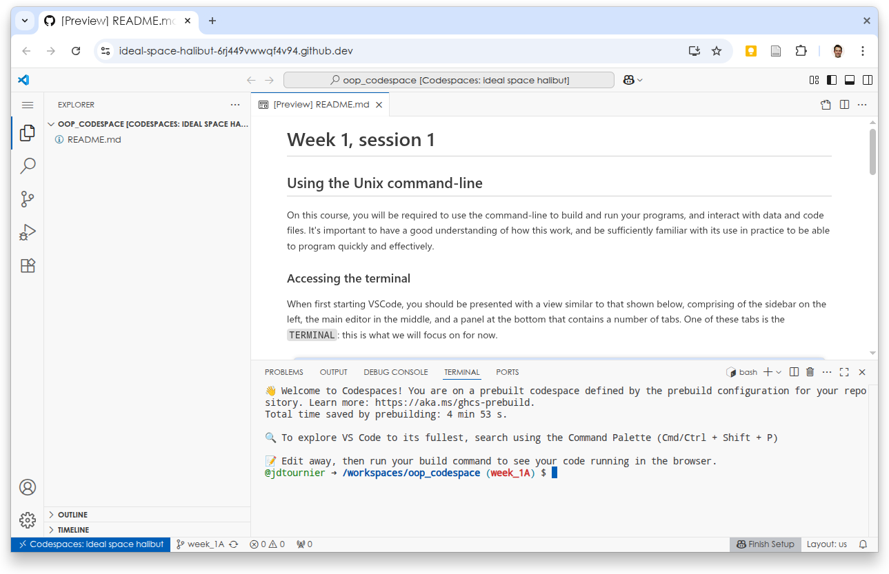
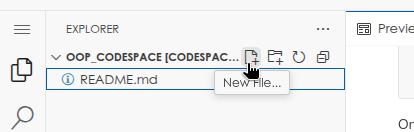
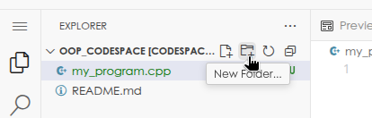
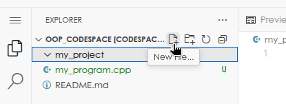
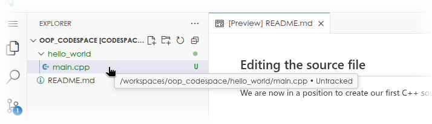

# Week 1, session 1

To start your codespace, use the green `Code` button ([click here](.) if it's not
visible).

# Using the Unix command-line

On this course, you will be required to use the command-line to build and run
your programs, and interact with data and code files. It's important to have a
good understanding of how this work, and be sufficiently familiar with its use
in practice to be able to program quickly and effectively.

## Accessing the terminal

When first starting VSCode, you should be presented with a view similar to that
shown below, comprising of the sidebar on the left, the main editor in the
middle, and a panel at the bottom that contains a number of tabs. One of these
tabs is the `TERMINAL`: this is what we will focus on for now. 



> 💡 If you cannot find the terminal because the bottom panel is not visible, try
> to *expand* the panel from the bottom using the mouse, or use the menu (the
> three horizontal lines near the top left) → *Terminal* → *New Terminal*.

## What is a terminal?

The terminal is also known as the *command-line terminal*, *command-line
interface (CLI)*, *console*, or *shell*. It is a text-based interface used to
interact with a computer's operating system. 

> 🎓 In reality, the command-line interface consists of two interacting parts: 
> - the *terminal* itself is responsible for displaying the text to the user,
>   and taking input from the user. It is not responsible for taking any
>   further action; it merely acts as an intermediary between the user and the *shell*.
> - the *shell* or *command-interpreter* is a program that interact with the
>   terminal, and processes and produces text. It is responsible for
>   *interpreting* the user's input, and running any programs as instructed. 
> 
> In essence, the *shell* is the 'brains' of the command-line interface, with the
> *terminal* itself providing the front end (a graphical interface that the user
> can interact with).
> 
> There are [many different terminals available](https://en.wikipedia.org/wiki/List_of_terminal_emulators), and
> [many different shells available](https://en.wikipedia.org/wiki/List_of_command-line_interpreters),
> which can all be used in different combinations. 


On this course, we will rely on the terminal provided by VSCode, and the
widely-used [Bourne-Again shell
(BASH)](https://en.wikipedia.org/wiki/Bash_%28Unix_shell%29), which is the
default on most Unix-based operating systems. The instructions on this course
are specific to the BASH shell, and will work in most Unix environments
(including macOS).


## The terminal prompt

The last line displayed on the terminal will normally be the 
[command-line prompt](https://en.wikipedia.org/wiki/Command-line_interface#Command_prompt),
which should look like this:


On these systems, the *prompt* is configured to display the
current `user` in green, followed by the current *working directory* (see
below) in blue, and the current branch in red (on this course, this will
correspond to the current worksheet or assignment). The last character will
typically be a dollar sign (`$`). 

> ⚠️ Don't be surprised if the prompt looks different when working
> in different environments. The information shown in the prompt can be
> [customised](https://linuxconfig.org/bash-prompt-basics), and it is not
> uncommon for it to look quite different. In fact, the prompt in GitHub
> Codespaces is itself heavily customised.

The *prompt* is a visual cue that the command-line interface is ready for you
to type in the next command. It will be displayed after the previous command has
finished running.

## The current working directory

You should already be familiar with using folders on your computer to organise
your documents. In computers, such folders are formally called 
[directories](https://en.wikipedia.org/wiki/Directory_%28computing%29). 
Directories are simple structures that are used to group a number of files or
other directories together. Because any directory can contain any number of other
directories, they can be used to form a hierarchical data storage system; this
is formally known as the
[filesystem](https://en.wikipedia.org/wiki/Hierarchical_file_system).

Every program, including the terminal, runs within a specific location in the
filesystem. In other words, it runs within its own [working
directory](https://en.wikipedia.org/wiki/Working_directory). In this
environment, you can see the terminal's current working directory in the
*prompt*, shown in blue. More generally, you can also query it using the `pwd`
command:

### The `pwd` command

The [pwd](https://www.geeksforgeeks.org/linux-unix/pwd-command-in-linux-with-examples/)
command stands for *print working directory*, and as expected, it displays the
*current working directory*:

```bash
@user ➜ /workspaces/oop_codespace (codespace) $ pwd
/workspaces/oop_codespace
```
<br>

▶️ Type the `pwd` command into the terminal now (and press return to execute). Is
your terminal also running within the `/workspaces/oop_codespace` folder?

<br>


## Listing files and folders in a directory

You can see the files and folders contained in the *current working directory*
using the `ls` command:

### The `ls` command

The [ls](https://www.geeksforgeeks.org/linux-unix/ls-command-in-linux/) command
is short for *list contents*, and prints out a list of the files and folders
contained in the current working directory:

```bash
@user ➜ /workspaces/oop_codespace (codespace) $ ls
README.md
```
<br>

▶️ Type this command into your terminal now. Do you also see the same files
listed?

<br>

▶️ Create a new file using the `EXPLORER` sidebar interface (see screenshot
below), and call it `my_program.cpp`. Now return to the terminal and type the
`ls` command again. Do you see your new file in the listing?



<br>

▶️ Create a new folder using the `EXPLORER` sidebar interface (see screenshot
below), and call it `my_project`. Now return to the terminal and type the `ls`
command again. Do you see your new folder in the listing?



<br>

▶️ Look at the files and folders listed in the `EXPLORER` sidebar: these should
match exactly what you see when using the `ls` command, since they are both
providing a view into the *same* directory. 

<br>

## Command-line arguments

We have so far used commands like `pwd` and `ls` without any additional
[arguments](https://en.wikipedia.org/wiki/Command-line_interface#Arguments).
But we can provide additional information to many commands to tell them more
precisely what we need them to do. 

For example, the `ls` command will by itself display the contents of the
current directory. But if we provide the name of a different directory, we can
ask it to list the contents of *that* directory:

<br>

▶️ Type `ls my_project` (note: this relies on you having created the `my_project`
folder as instructed above). Do you see any files listed?

```bash
@user ➜ /workspaces/oop_codespace (codespace) $ ls my_project
```
<br>

▶️ The previous command was not very interesting as the `my_project` folder is
currently empty. Use the `EXPLORER` sidebar to create a new file called
`main.cpp`, within the `my_project` folder. For this to work, you need to first
*select* the `my_project` folder to highlight it, as shown in the screenshot
below, then press the 'New file' button. 



Now return to the terminal and try the `ls my_project` command again. Do you
see your new file in the listing? 

<br>

In the example above, the `ls` command was used with a single command-line
argument: the name of the folder to be listed, `my_project`. This is a general
principle: when typing a command, the first 'word' is the *name* of the
command, followed by any *arguments* separated by spaces.

You'll note that this will create problems when filenames themselves
contain spaces, which is why this is *strongly* discouraged when programming. 

<br>

▶️ Create a new folder with `oop_codespace`, called `another project` &ndash; this time, leave a
space in the folder name. 

> ⚠️ Watch out for *where* you create your folder: you'll probably still
> have the `my_project` folder selected, and if you don't *deselect* it first
> by clicking elsewhere to make sure it is no longer highlighted, you'll be
> creating your new folder within the `my_project` folder.

Now return to the terminal and try to list your new folder. Can you guess what happened?

> 🎓 *There are ways to handle spaces in filenames, for example by enclosing the
> whole argument in inverted commas (e.g. `ls "another project"`). But given
> how often problems arise due to spaces in filenames, it is **much** easier
> simply to avoid them altogether.*

<br>

### The `touch` command

The [touch](https://www.geeksforgeeks.org/linux-unix/touch-command-in-linux-with-examples/)
command can be used to create new empty files (though technically its purpose
is to update a file's modification time), by providing the name of the
file to be created as the *argument*.

<br>

▶️ Enter the following command into the terminal: `touch another_program.cpp`.
Then enter the `ls` command again. Do you see a new file called
`another_program.cpp` in the listing?

<br>

### The `mkdir` command

the [mkdir](https://www.geeksforgeeks.org/linux-unix/mkdir-command-in-linux-with-examples/)
command is used to create folders or *directories*, by providing the name of
the folder to be created as the *argument*.

<br>

▶️ Enter the following command into the terminal: `mkdir another_project`. Then
enter the `ls` command again. Do you see a new folder called `another_project`
in the listing?

<br>

## Command-line options

By convention, some specially-formatted arguments can be used to provide
optional information to the command, which will typically modify the behaviour
of the command in some way. These are called 
[command-line options](https://en.wikipedia.org/wiki/Command-line_interface#Command-line_option),
and in the Unix convention, consist of a single *dash* or *hyphen* (`-`)
followed by a letter (short version), or two dashes followed by a longer word
(long version).

For example, many commands accept the `-h` or `--help` option &ndash; including
the `ls` command:

<br>

▶️ Try typing the `ls --help` command. What does this do?

<br>

▶️ Try typing the `ls -l` command. What does this do?

<br>

It is not always obvious to figure out how to use a command, what arguments is
expects, and what options is accepts. Try running the command with the `--help`
option. If that doesn't work, you can always find the documentation online
(along with helpful tutorials, etc.)!


## Changing the current working directory

In general, we will want to write our programs within their own folders, as
they will often consist of several files. We can create folders using
the `EXPLORER` sidebar in VSCode, or the
[mkdir](https://www.geeksforgeeks.org/linux-unix/mkdir-command-in-linux-with-examples/)
command introduced above. We can then change our current working directory
using the `cd` command.

### The `cd` command

The [cd](https://www.geeksforgeeks.org/linux-unix/cd-command-in-linux-with-examples/)
command stands for *change directory*, and allows us to modify the terminal's
current working directory. 

When running `cd` with an argument, the argument is taken to be the name of the
folder to change into, *relative to the current working directory* (we will see
what that means later). 

> ⚠️ If no arguments are provided, `cd` changes the current working directory to the
> current user's [home folder](https://en.wikipedia.org/wiki/Home_directory).
> 
> On GitHub Codespaces, the home folder is not the same as the workspace
> folder! If you need to return to the main workspace folder, use the
> following command:
> ```bash
> @user ➜ ~ (codespace) $ cd $CODESPACE_VSCODE_FOLDER
> ```

<br>

▶️ Change directory into the `my_project` folder (note that this assumes you
have already created this folder earlier):

```bash
@jdtournier ➜ /workspaces/oop_codespace (week_1A) $ cd my_project
```

Verify your current working directory using the `pwd` command. Also check which
files are present in this folder using the `ls` command.

<br>

### Special directory names

There are a few shorthand names for special folders, which are often important
to know about. These are:

- **The current working directory: `.`** \
  This allows you to refer to the current working directory, which is useful in
  various circumstances (we will come across some of these later).

- **The parent folder of the current working directory: `..`** \
  This allows you to refer to the folder one level up in the hierarchy, which
  is essential to change directory back one level. 

- **The current user's [home folder](https://en.wikipedia.org/wiki/Home_directory): `~`** \
  This allows you to refer to your own home folder.

- **The *previous* working directory: `-`** \
  This only works with the `cd` command, but is useful to return to the
  previous folder, using the `cd -` command.


<br>

▶️ Assuming you are currently in the `my_project` folder, return to the original
workspace folder using the special `..` identifier: 
```bash
@jdtournier ➜ /workspaces/oop_codespace/my_project (week_1A) $ cd ..
```

Verify that you are back in the original workspace folder using the `pwd`
command, and list the contents using `ls`.

<br>

With these basic commands and concepts, you are already in a position to make
use of the command-line. However, to get the most out of the terminal, we need
to understand how to refer to files and folders, wherever they are &ndash; this
is the topic of the next section.

## Command-line tips & tricks

Typing long commands over and over again can quickly get tiresome.
Thankfully, modern command interpreters provide handy shortcuts to make life
easier &ndash; please get used to them as early as you can!

- [**command history**](https://en.wikipedia.org/wiki/Command_history): the
  **up/down arrows** allow you recall previously typed commands, which you can
  then edit and modify as required (using the left/right arrows). This is very
  useful when you've made a simple typo on a long command!

- [**tab completion**](https://en.wikipedia.org/wiki/Command-line_completion):
  the **TAB key** asks the shell to complete the current word if it has enough
  information to do so. For example, typing `cd Doc`, then pressing `TAB` will
  complete the command to `cd Documents` 
  - *provided* there is a `Documents` folder at that location
  - *and* there are no other folders that start with `Doc`

> 💡 You are **strongly** encouraged to learn more about how to use the shell.
> Please take a look through any of the many tutorials available online, in
> particular our own [Introduction to the Unix
> command-line](https://command-line-tutorial.readthedocs.io/)]


# Absolute and relative paths

You can already refer to folders and files that reside in the current working
directory &ndash; and in many cases this is sufficient. However, we can always
refer to any file or folder on the system, by providing its 
[relative or absolute path](https://www.geeksforgeeks.org/linux-unix/absolute-relative-pathnames-unix/).

## Absolute path

The concept of an absolute path makes sense by analogy with a tree: branches
are folders, and leaves are files. Starting from the *root* of the tree, we
specify each branch in turn that will eventually reach the target file or
folder we are interested in. 

In Unix, the *root* of the *filesystem* is denoted as a simple forward slash
(`/`). If we write the path starting with a forward slash, this  indicates that
it is an *absolute path*, since we are starting from the root. 

In Unix, nested folders are also separated by a forward slash (this referred to as
the [path separator](https://en.wikipedia.org/wiki/Path_%28computing%29)) (also
known as the *path delimiter*, or *directory delimiter*). This differs from
Microsoft Windows, which uses the backslash (`\\`) as the path separator.

To illustrate, the absolute path to our `main.cpp` file, which we created in
the `my_project` folder, is:
```
/workspaces/oop_codespace/my_project/main.cpp
```
This means that it resides within the `my_project` folder, which itself resides
within the `oop_codespace` folder, which itself resides within the `workspaces`
folder, which resides in the root folder. 


## Relative path

We can specify a file *relative to the current working directory* using its
*relative path*. Indeed, this is what we have been doing so far. In this case,
we provide the sequence of folders and files that will take us from the current
working directory to the file or folder we are interested in. To use relative
paths properly, we must therefore always keep an eye on our current working
directory!

For example, if our current working directory is `/workspaces/oop_codespace`
(the initial workspace folder), we can refer to this `README.md` simply as
`README.md`, or to our `my_project` folder simply as `my_project`: both reside
within the current working directory. 

But we can also refer to the `main.cpp` file we created earlier in the
`my_project` folder: `my_project/main.cpp`. In essence, the system will join
together or *concatenate* the *current working directory*
(`/workspaces/oop_codespace`) with the *relative path* we provided
(`my_project/main.cpp`), and insert the *path separator* in between. As you can
see, this produces the same *absolute path* as we discussed earlier for that
same file. 

We can use this concept to work more easily within our project folder, since we
can refer to all the files and folders contained within using much shorter
*relative paths*. But we can also refer to files within subfolders, or even
outside of the current folder, using longer relative paths. The following
exercises will help to illustrate this. 

## The `tree` command

The [tree](https://www.geeksforgeeks.org/linux-unix/tree-command-unixlinux/)
command displays files and folders recursively and presents them in a tree
structure. This is useful to quickly inspect more complex folder structures,
which we may come across later on.

> ⚠️ On most systems, the
> [tree](https://www.geeksforgeeks.org/linux-unix/tree-command-unixlinux/)
> command is not installed by default.  If you work on different environments,
> don't be surprised if it's not available &ndash; you may need to install it
> yourself.


<br> 

▶️ Set your current working directory to the original workspace folder:
```bash
@jdtournier ➜ /workspaces/oop_codespace/my_project (week_1A) $ cd $CODESPACE_VSCODE_FOLDER
```
Now try the `tree` command:
```bash
@jdtournier ➜ /workspaces/oop_codespace (week_1A) $ tree
```
What do you see?

<br>

▶️ Let's create a more complex file structure. Type the following commands (you
can simply copy/paste them as one):
```
touch my_project/my_functions.h
mkdir my_project/data
touch my_project/data/file1.dat
touch my_project/data/file2.dat
touch my_project/data/file3.dat
touch my_project/data/file4.dat
mkdir another_project
touch another_project/main.cpp
touch another_project/utils.h
touch another_project/utils.cpp
```

Now try the `tree` command again. What do you see? How does that compare to
what you see in the `EXPLORER` sidebar?

<br>

▶️ Without changing your current working directory, can you list the contents of
the `data` folder within the `my_project` folder?

<br>


<br>

▶️ Change directory to the `another_project` folder. Can you use a *relative
path* to list the contents of the `data` folder within the `my_project` folder?

> 💡 Remember that the `my_project` folder resides within the *parent folder* of
> the `another_project` folder &ndash; and that we can refer to a parent folder
> using the `..` special identifier. 

<br>

## The `cp` command

We can copy files using the
[cp](https://www.geeksforgeeks.org/linux-unix/cp-command-linux-examples/)
command, by providing the *path* to the file to be copied as the first argument
(the *source*), and the *path* to the destination file or folder. If the
destination is a file, this will be the filename of the copy. If the
destination is a folder, the filename of the copy will be the same as the
source, but placed within the destination folder. 


<br>

▶️ With your current working directory set to the `another_project` folder, use
the `cp` command to copy the `utils.h` file to the `my_project` folder. 

<br>

▶️ With your current working directory set to the original workspace folder
(`/workspaces/oop_codespace`), use the `cp` command to copy the `utils.cpp`
file in the `another_project` folder into the `my_project` folder. 

<br>


## The `mv` command

We can use the
[mv](https://www.geeksforgeeks.org/linux-unix/mv-command-linux-examples/)
command to move a file to a different folder, and/or rename the file. As was
the case with `cp`, this command expects two arguments: the path to the source
file, and the path to the destination file or folder. If the destination is a
folder, the file will be moved into that folder with the same name. If the
destination is a file, the file will be renamed in the process (note that the
destination file can be in the same or a different folder). 


<br>

▶️ With your current working directory set to the original workspace folder
(`/workspaces/oop_codespace`), use the `mv` command to rename the
`another_project` folder to `second_project`

<br>

▶️ Use the `mv` command to rename the `main.cpp` file in the `my_project` folder
to `loader.cpp`. Try to do this within the main workspace folder, or within the
`my_project` folder.

<br>

▶️ Use the `mv` command to move your newly-renamed `loader.cpp` file from the
`my_project` folder to the (also freshly-renamed) `second_project` folder. Try
to do this from within the main workspace folder, from within the `my_project`
folder, and from the `second_project` folder. 

> 💡 For that last question, remember that you can refer to the current folder
> using the `.` special identifier. 

<br>


## The `rm` command

We can also remove or delete files using the 
[rm](https://www.geeksforgeeks.org/linux-unix/rm-command-linux-examples/)
command, by providing the path to the file to be removed as the argument. We
can provide multiple arguments to the `rm` command to remove multiple files at
the same time.

> ⚠️ Be careful with the `rm` command: **it will delete files *permanently*!**

<br>

▶️ Use the `rm` command to delete the `main.cpp` file from the `second_project`
folder.

<br>

We can also delete entire folders and all of their contents by providing the
`-r` option to the `rm` command.

> ⚠️ Be **very** careful with the `rm -r` command: **it is easy to delete entire
> projects that way!**


<br>

▶️ Use the `rm -r` command to delete the entire `second_project` folder.

<br>


> 💡 If you mess anything up (e.g. by removing the wrong thing...), no
> problem!
> 
> Remember that you can easily start from scratch again: simply close
> the browser window where your codespace is displayed, then go back to the
> worksheet page, click on the green `Code` button, and delete the workspace.
> You can then start another fresh one and carry on. 


# Creating our first C++ program

So far, we have been using existing programs and commands. It's time to write
your own. 

At this stage, it's a good idea to clear up the files and folders we created in
earlier exercises. 


<br>

▶️ Use the `rm -r` command to delete both project folders. This `README.md` file
should be the only file remaining. 

Alternatively, use the `EXPLORER` sidebar to delete them. 

<br>

## Create a folder to hold your project

It's always a good idea to group all files that relate to a specific project
within a single folder. This avoids mixing files between projects, and avoids
confusion: everything in that folder relates to your project, and nothing else. 

<br>

▶️ Use the `mkdir` command to create a folder called `hello_world`. 

Alternatively, use the `EXPLORER` sidebar to achieve the same outcome.

<br>

▶️ Now, change your working directory to that folder, using the `cd` command.

Verify that your current working directory is
`/workspaces/oop_codespace/hello_world`, as expected. You can do this using the
`pwd` command, or by looking at your prompt (remember: the text in blue
corresponds to your current working directory).

<br>


## Editing the source file

We are now in a position to create our first C++ source file. We can do this in
several ways:

<br>

▶️ Create an empty file called `main.cpp` within the `hello_world` folder, using
the `touch` command.

Alternatively, use the `EXPLORER` sidebar to achieve the same outcome.

<br>

▶️ We can now open the file in the editor, by clicking on it from the
`EXPLORER` sidebar.



Alternatively, you can use the `Ctrl+O` keyboard shortcut (`Cmd+O` on macOS),
or the *File* → *Open File...* menu entry (accessed by clicking on the 3
horizontal lines at the top left of the screen). 

> ⚠️ Please ignore any suggestions to open the chat (GitHub Copilot) or use any
> other form of AI assistance. Unfortunately, Microsoft seems very keen for
> everyone to use it, but using these tools when you are still learning will
> only get in the way of your learning. 

Finally, we are now ready to write our code. 

<br>

▶️ Enter the following into the editor window:

```cpp
#include <iostream>

int main()
{
  std::cout << "Hello, World!\n";
  return 0;
}
```

Alternatively, you can copy and paste the text directly into the editor. 

<br>

> ⚠️ Normally, you would need to make sure to *save* the file at this point: a
> common cause of confusion is trying to compile your code after editing it,
> and wondering why your changes have had no effect...
> 
> However, on GitHub Codespace, your files are automatically saved as soon as
> you've edited them &ndash; no need to save them explicitly every time!


## Compiling the code

Now that we have a source file, we are ready to *compile* it.  To do this, we
need to run a program called the
[compiler](https://en.wikipedia.org/wiki/Compiler), and instruct it to produce
an executable from our code. There are
[many compilers available](https://en.wikipedia.org/wiki/List_of_compilers),
but on this course we will use the widely-used open source
[GNU C++ compiler](https://gcc.gnu.org/), `g++`.

> 🎓 In software development, the
> [compiler](https://en.wikipedia.org/wiki/Compiler) is program whose job is to
> the *translate* your human-readable (C++) code into *machine code* (a binary
> representation of the specific machine instructions that the CPU will
> execute). This involves validation of the code, checking for any ambiguities
> or syntax errors, etc., various levels of optimisation, and translation into
> the specific [instruction set](https://en.wikipedia.org/wiki/Instruction_set_architecture) 
> expected for your computer &ndash; this is a
> [complex process](https://www.geeksforgeeks.org/c/compiling-a-c-program-behind-the-scenes/),
> involving many steps. We will only cover the basics of compilation on this
> course.

To compile a single code file into an executable, we can invoke the compiler
directly, providing our input code file as the argument, and providing the name
of the executable to be produced using the `-o` option:

<br>

▶️ Compile your `main.cpp` file to produce an executable called `hello`, using
the following command:
```bash
@jdtournier ➜ /workspaces/oop_codespace/hello_world (week_1A) $ g++ main.cpp -o hello
```

Verify that the executable `hello` was indeed produced by listing the contents of the
current working directory using `ls`.

<br>

## Running the program

The file `hello` produced in the previous step is our executable. To run it, we
need to instruct the shell to launch it for us. 

<br>

▶️ Type the command `hello`. Does this work?

<br>

As you can see, simply typing the name of the command is not sufficient. This
is because *unless otherwise specified*, the shell will only consider
executables stored in a specific list of folders, the [system
path](https://en.wikipedia.org/wiki/PATH_%28variable%29). Our project folder is
not on the list, so the shell will not consider any files located there. 

We could add our project folder to the system path, but this is generally not
recommended (doing so [could be considered a security
risk](https://www.expressvpn.com/blog/cybersecurity-lessons-a-path-vulnerability-in-windows/)). Instead, we can invoke our command by providing the *path* to our executable:

<br>

▶️ Try running your command using its *absolute* path:
```bash
@jdtournier ➜ /workspaces/oop_codespace/hello_world (week_1A) $ /workspaces/oop_codespace/hello_world/hello
Hello, World!
```

<br>

By providing the explicit path to our executable, we are instructing the shell
to ignore the system path, and locate our executable directly. We can now run
our executable, and it produces the expected output!

However, we can reduce the amount of typing we need to do (and the scope for
mistakes) by providing a *relative* path instead &ndash; but we need to make
sure the shell *has* to interpret it as a relative path, otherwise it will
search the system path as before. We can do this by specifying the location of
our executable as being in the current folder, using the `.` special specifier
(mentioned earlier):

<br>

▶️ Try running your command using its *relative* path:
```bash
@jdtournier ➜ /workspaces/oop_codespace/hello_world (week_1A) $ ./hello
Hello, World!
```

<br>

In practice, this is how we will run most of our commands.

## How does this program work?

We managed to run a simple program, but how does it work? Let's go through the
program line by line. Here is the program we wrote:


```cpp
#include <iostream>

int main()
{
  std::cout << "Hello, World!\n";
  return 0;
}
```

### The `#include` preprocessor directive

Most programming languages have a concept of 'modules', each providing
specific functionality. The `#include` directive is how this is done in C++.
Our program needs to use `std::cout`, and this is declared in
`<iostream>`, so we need to `#include` it for the compiler to understand how to
use `std::cout`. 

> 🎓 This is true for C++ code prior to the introduction of
> [C++20 modules](https://www.geeksforgeeks.org/cpp/modules-in-cpp-20/), which
> provide an alternative mechanism to support modules. But these are not widely
> used yet, and will not be covered on this course. 

In more detail, lines beginning with a `#` symbol are so-called [preprocessor
directives](https://www.geeksforgeeks.org/c/cc-preprocessors/). The
preprocessor runs as part of the compilation process, *before* the compiler
proper. Its job is to process these directives and perform the appropriate
actions. 

The `#include` directive instructs the preprocessor to insert the contents of
the file specified into the current file at this point, before feeding the
combined file through to the compiler itself. Here, the [`<iostream>` *header*
file](https://www.geeksforgeeks.org/cpp/basic-input-output-c/) contains the
function and object declarations we need to interact with the
terminal.

> 💡 We will explain *header files* later in the course. 

### The `main()` function

### Standard output and input/output streams

### String handling

### The `return` statement

# Summary

## Important concepts

- the command-line
- commands and arguments
- directories and the file system
- absolute and relative paths

## Useful commands

- `ls`: list current working directory
- `pwd`: print name of current working directory
- `cd`: change working directory
- `mkdir`: create a new folder (directory)
- `touch`: create a new empty file
- `tree`: display a recursive listing of files and folders
- `mv`: move or rename a file
- `cp`: copy a file (or folder)
- `rm`: remove a file (or folder)

## Writing a C++ program

- Editing the source file
- Compiling the C++ code into an executable
- Running the resulting executable

