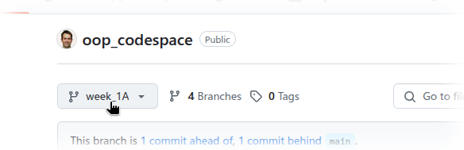
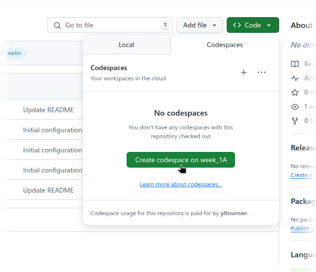
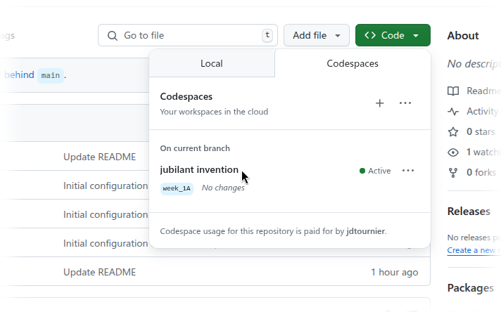
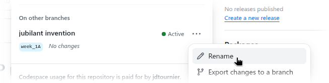
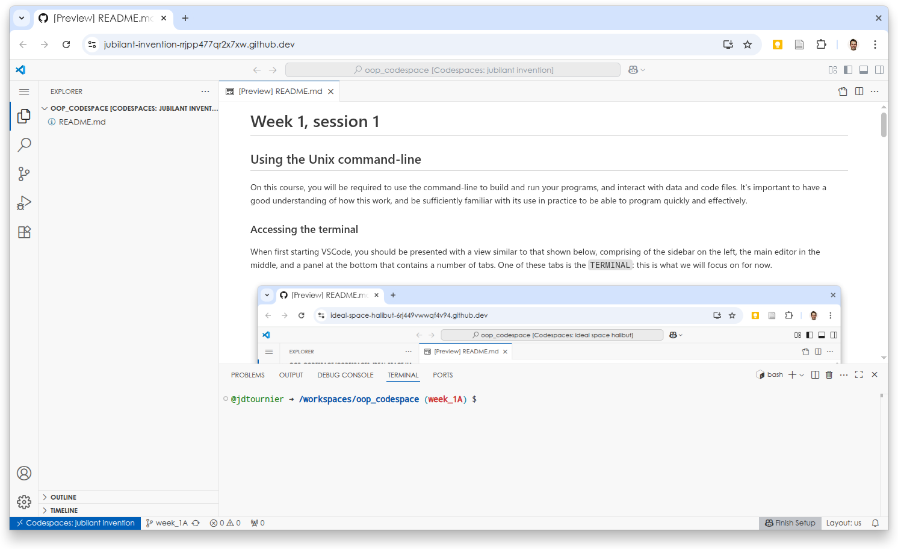
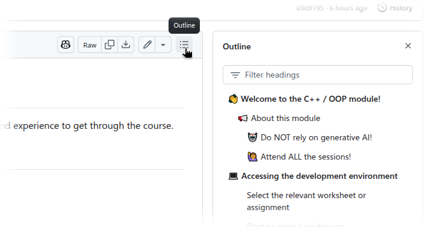

# 👋 Welcome to the C++ / OOP module!

This page provides access to the tasks and assignments that will give you the
necessary practice and experience to get through the course. 

## 📢 About this module

To complete this course, please pay close attention to the following:

### 🤖 Do NOT rely on generative AI!

The use of generative AI tools (chatGPT, Microsoft Copilot, Google Gemini,
Claude Sonnet, ...) is **strictly forbidden** for *all* formative assessments
on this course. All assessments will be monitored, and any student caught using
such tools will immediately be referred to the Student Conduct & Appeals
Office, according to [KCL academic misconduct
procedures](https://self-service.kcl.ac.uk/article/KA-01219/en-us).

The use of these tools is also **very strongly** discouraged in general on
this module. In our experience, and [that of many other
professionals](https://time.com/7295195/ai-chatgpt-google-learning-school/), 
generative AI can all too easily be abused to provide easy answers to tasks and
assignments, depriving students of the opportunity to learn and build up the
necessary experience. When faced with formal assignments where these tools are
prohibited, students who have previously relied on these tools find themselves
incapable of performing even the simplest tasks.

The exercises and tasks we have compiled on this course are designed to build
up your understanding and most importantly, your *experience* with programming.
To be an effective programmer, it is not sufficient to *understand* the material:
you need to *think* like a programmer, and that will only come with a lot of practice.

If you find yourself struggling with a specific exercise or task, don't worry:
you are meant to! Resist the urge to use AI for an easy fix, and try to work
out the problem for yourself. You are encouraged to use regular online searches
to understand specific error messages, or to find inspiration for how to
approach certain problems, but it is *essential* that you take these times as
opportunities to learn and improve your own skills. If you do, you will quickly
find yourself making fewer and fewer mistakes, writing better code, and
completing tasks and assignments faster.

### 🙋 Attend ALL the sessions!

All sessions will be held in Student Computer Rooms, and are designed as
practical, hands-on tutorials. These will provide you with regular blocks of
time to practice &ndash; and practice is essential to get through this module!

In addition, there will be plenty of teaching staff and assistants on hand to
help you along. It is much better to ask one of us when you get stuck, than to
ask a chatbot!

The best way to build up enough programming experience to do well on this
module is to attend all the sessions in person.

# 💻 Accessing the development environment

This module will rely on 
[GitHub Codespaces](https://github.com/features/codespaces) to provide a
consistent development environment for all students. To access this
environment, you will first need to [create a personal GitHub
account](https://github.com) (if you haven't already), and sign in. 

### Select the relevant worksheet or assignment

You can click on the links in the [full list shown
below](#-worksheets-and-assignments), or use the drop-down selector as shown
below:

### Start or open a workspace

To start a new workspace for the current worksheet, use the green `Code`
drop-down button, as shown below:

⚠️ If you've already started a codespace for this worksheet, you can carry on
where you left off. Your codespaces will remain live for a few weeks after you
last used them! If you already have a live codespace, you will see an entry
listed under 'On current branch', as shown below (each codespace is assigned a
random name). Just click on the name of the codespace to log back into it.

> 💡If you wish, you can rename your workspace to match the worksheet or session. Click on the three dots next to the codespace, and select the rename menu entry, as shown below:

### Wait until the workspace is ready

This can take a couple of minutes, depending on current usage, etc. You should
eventually see a page similar to that shown below. This is a full-blown [Visual
Studio Code](https://code.visualstudio.com/) (VSCode) environment, running on a
virtual instance on the Cloud. When fully loaded, you should see the sidebar on
the left, the panel at the bottom, and the worskheet's README displayed in the
centre.

.

### If necessary: delete and start a fresh codespace!

If you need to restart from scratch, you can easily delete your current
workspace (using the same 3 dots menu as for renaming above), and start a new
one for any of the worksheets. 

# 📝 Worksheets and assignments

The best way to display these worksheets is via the GitHub site. You can
navigate through the worksheet using the 'Outline' feature, accessible using
the little 'table of contents' symbol, as shown below:

.

## Worksheets per session

- [Week 1, session 1](../week_1A/README.md)
  

## Assignments

These will be made available when required. Until then, the links below will
**not** work.

- [Practice coursework 2](../practice_CW2/README.md)
